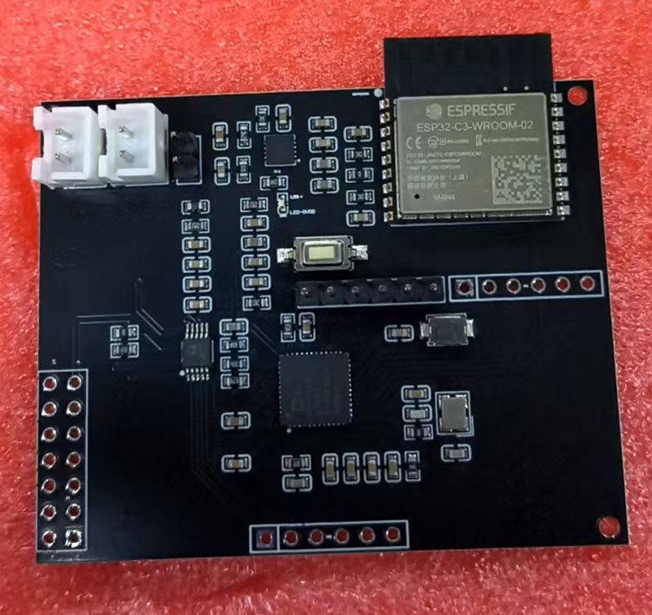
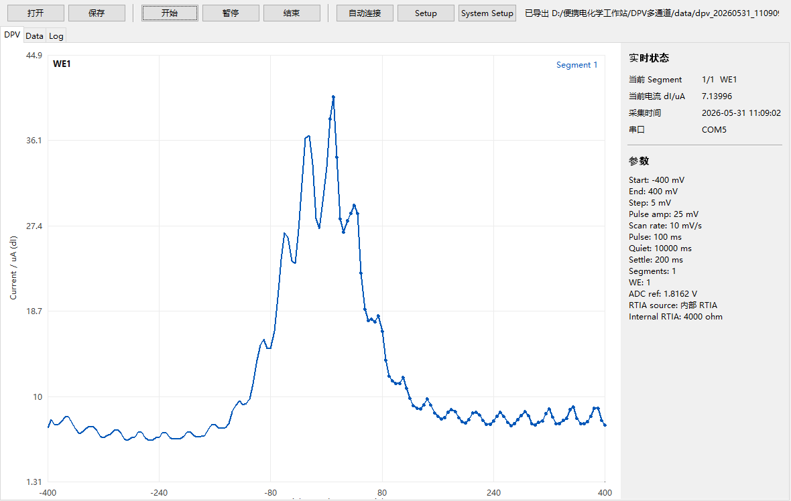
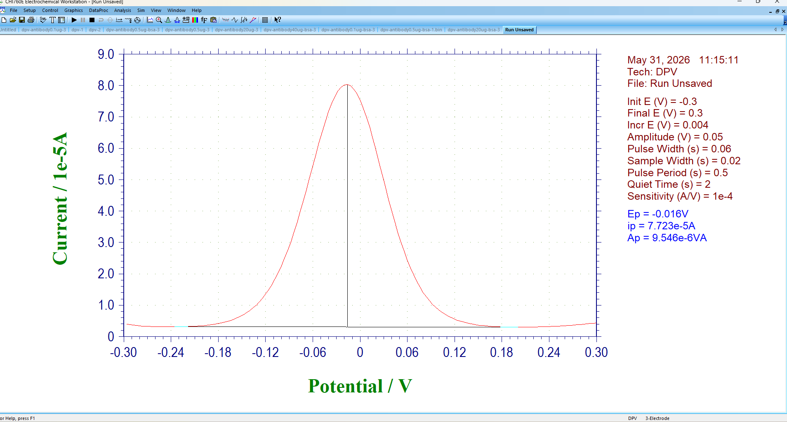

AD5941 ESP32-C3 多通道 DPV 电化学检测项目

1. 项目简介

这是一个基于 AD5941 和 ESP32-C3 的差分脉冲伏安法 DPV 电化学检测项目，目标是做一个低成本、小型化、可以用于生化实验室测试的电化学检测板。板子通过 AD5941 完成电化学激励、电流采集和模数转换，通过 ESP32-C3 运行 Arduino 驱动程序，并把 DPV 数据发送到电脑上位机进行实时显示和保存。

硬件支持 3 个工作电极 WE1、WE2、WE3，通过 ADG704 模拟开关分时切换。当前已经分别验证过 WE1、WE2、WE3 单通道工作正常。系统设计上支持多种数据读取和保存方式，包括串口上位机、WiFi 网页监测以及 TF 卡数据存储，便于后续根据实验场景选择不同的数据记录方式。

电路板实物图如下。

2. 当前实现的功能

当前系统支持电脑上位机通过串口连接 ESP32-C3，设置 DPV 参数、系统参数、开始测试、停止测试、实时显示曲线并保存数据。上传的数据包括工作电极通道、电位、电流、差分电流、采样时间和有效标志。

目前支持 WE1、WE2、WE3 三个工作电极选择。正式 DPV 测量建议使用 AD5941 内部 RTIA，目前推荐内部 RTIA 为 10000 ohm。当前板子的 RCAL 推荐设置为 195 ohm，这个值来自前期电阻负载校准结果。

3. 测试结果

本项目已经用电阻负载做过基本校准。使用 100 k ohm 电阻时，0 到 200 mV 扫描下测得电流与理论值基本一致，说明电压输出、电流采集和数据上传流程是通的。

本项目也已经在铁氰化钾溶液中测到 DPV 峰值。虽然曲线仍有波动，峰值幅度和商业电化学工作站还有差异，但已经能够看到明显电化学峰，说明硬件和驱动具备基本检测能力。

本项目 AD5941 板子的铁氰化钾 DPV 测试结果如下。

商业电化学工作站在类似铁氰化钾测试中的 DPV 结果如下，用于对照。

从结果看，自制板可以测出峰，但曲线比商业工作站更抖，峰值大小也还没有完全一致。这个差异可能来自 DPV 参数没有完全匹配、电极状态、溶液状态、模拟前端噪声、采样时刻和 RTIA 设置等因素。

4. 推荐测试参数

系统参数建议：RCAL 设置为 195 ohm，RTIA 类型选择内部 RTIA，内部 RTIA 设置为 10000 ohm，ADC Ref 设置为 1.8162 V，ADC PGA 设置为 1.5，VZERO 设置为 1100 mV，Timeout 可设置为 1000 到 2000 ms。

电阻负载校准建议：Start 设置为 0 mV，End 设置为 200 mV，Step 设置为 20 mV，Pulse Amp 设置为 0 mV，Quiet Time 设置为 2000 ms，Settle Time 设置为 100 到 200 ms。

铁氰化钾 DPV 测试建议优先对齐商业电化学工作站参数。例如 Start 设置为 -300 mV，End 设置为 300 mV，Step 设置为 4 或 5 mV，Pulse Amp 设置为 50 mV，Pulse Time 设置为 60 ms，Quiet Time 设置为 2000 ms，Settle Time 设置为 200 ms。

如果曲线波动较大，可以先降低扫描速度、增大 Settle Time、确认电极夹子接触、检查气泡和溶液稳定性。不要一开始同时改很多参数，否则很难判断是哪一个因素起作用。

5. 目前需要注意的问题

当前项目还不是商业电化学工作站的替代品，而是一个已经能测出 DPV 峰值的原型系统，后续还需要继续做生化标定和重复性测试。

目前需要特别注意：① 外部 RTIA 相关电阻目前只建议用于硬件诊断，不建议作为正式 DPV 的 RTIA 路径；② DPV 结果对电极状态、溶液浓度、气泡、夹子接触、静置时间、脉冲幅度和采样时刻都很敏感；③ 与商业电化学工作站比较时，应尽量保持扫描范围、阶跃电压、脉冲幅度、脉冲时间、静置时间和电极条件一致；④ 如果结果波动较大，应先确认实验条件，再调整驱动参数。

6. 后续计划

后续计划主要包括：① 用不同浓度铁氰化钾溶液做标定曲线，比较自制板和商业电化学工作站的峰电流、峰电位和重复性；② 优化 DPV 采样时刻、平均方式和抗噪声处理，让曲线更平滑；③ 做 WE1、WE2、WE3 的重复性测试，确认多工作电极切换是否会带来系统偏差；④ 继续完善 WiFi 网页监测、TF 卡本地存储和上位机标定流程，让设备更适合后续实验室使用。

7. 仓库内容

本仓库主要包含 Arduino 驱动代码、AD5941/AD5940 相关支持文件、ESP32-C3 和 AD5941 的引脚配置、DPV 参数说明、原理图文件，以及铁氰化钾测试结果图片和商业工作站对照图片。
