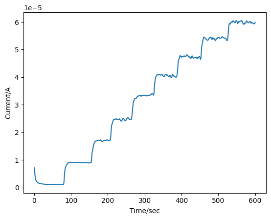
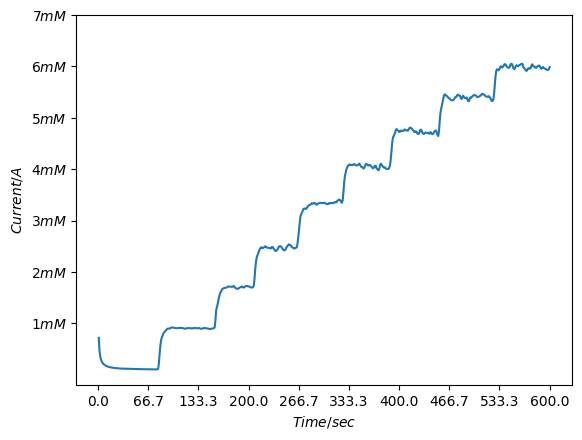
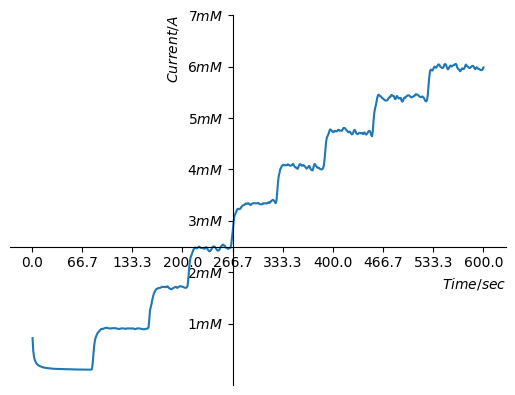
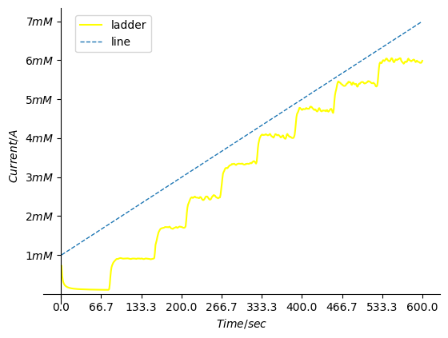
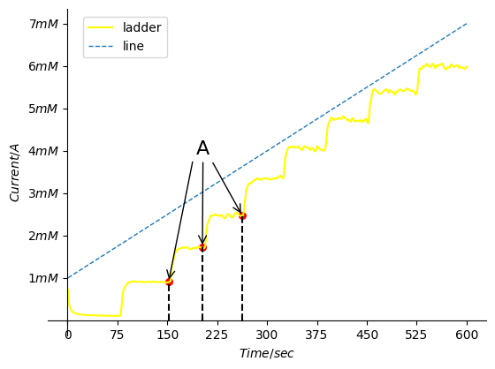
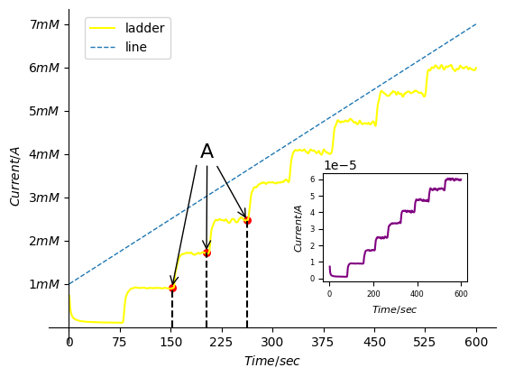

# 使用matplotlib绘图

以电化学工作站it图为例：

预处理函数：

~~~python
def IT_preprocess(path):
  file = open(path,'r')  #打开文件
  data = file.readlines() #读取所有行
  data_length = len(data)

  _,Interval = data[9].split('=')
  _,Run_Time = data[10].split('=')
  Interval = eval(Interval)
  Run_Time = eval(Run_Time)
  length = Run_Time/Interval
  Time = []
  Current = []
  for i in range(int(length)):
    _ = data[data_length - i - 1].split(',')
    t = eval(_[0])
    c = eval(_[1])
    Time.insert(0,t)
    Current.insert(0,c)

  return Time,Current 
~~~

## 简单绘制x，y

~~~python
a,b = IT_preprocess('your path') #预处理txt文件

import matplotlib.pyplot as plt

plt.plot(a,b)
plt.xlabel('Time/sec')
plt.ylabel('Current/A')  #修改x,y轴的title
plt.show()
~~~

## 修改x轴间隔，修改y为对应的文字描述

~~~ python
plt.plot(a,b)
plt.xlabel('$Time/sec$')
plt.ylabel('$Current/A$')
new_tick = np.linspace(0,600,10)
plt.xticks(new_tick)
#plt.yticks([1e-5,2e-5,3e-5,4e-5,5e-5,6e-5,7e-5,8e-5,9e-5],['1mM','2mM','3mM','4mM','5mM','6mM','7mM','8mM','9mM'])
plt.yticks([1e-5,2e-5,3e-5,4e-5,5e-5,6e-5,7e-5,8e-5,9e-5],['$1mM$','$2mM$','$3mM$','$4mM$','$5mM$','$6mM$','$7mM$','$8mM$','$9mM$'])#加了$会斜体输出，更加好看
plt.show()
~~~

## 在图上放置坐标轴

~~~python
plt.plot(a,b)
plt.xlabel('$Time/sec$',loc = 'right')
plt.ylabel('$Current/A$',loc = 'top')
new_tick = np.linspace(0,600,10)
plt.xticks(new_tick)
plt.yticks([1e-5,2e-5,3e-5,4e-5,5e-5,6e-5,7e-5],['$1mM$','$2mM$','$3mM$','$4mM$','$5mM$','$6mM$','$7mM$'])

ax = plt.gca() #把当前图的坐标轴拿出来
ax.spines['right'].set_color('none')
ax.spines['top'].set_color('none')
ax.xaxis.set_ticks_position('bottom')
ax.yaxis.set_ticks_position('left')
ax.spines['bottom'].set_position(('data',2.5e-5))
ax.spines['left'].set_position(('data',266.7))

plt.show()
~~~

## 在图中放入图例

~~~ python
x = np.linspace(0,7e-5,600)
y = x+1e-5
l1, = plt.plot(a,b,label = 'ladder',color = 'green') #l1后面必须要有,
l2, = plt.plot(a,y,linewidth = 1.0,linestyle = '--',label = 'line')
plt.xlabel('$Time/sec$')
plt.ylabel('$Current/A$')
new_tick = np.linspace(0,600,10)
plt.xticks(new_tick)
plt.yticks([1e-5,2e-5,3e-5,4e-5,5e-5,6e-5,7e-5],['$1mM$','$2mM$','$3mM$','$4mM$','$5mM$','$6mM$','$7mM$'])

#plt.legend(handles=[l1,l2,],loc = 'best') #handles就是plot的返回值，这里也可以加label，加了就不会用plot中的label了，loc可以用(num1,num2)形式调整，也可以用英文描述
plt.legend(handles=[l1,l2,],loc = (0.08,0.85))

~~~

## 在图中加入注解

### 1.annatation

~~~python
plt.scatter(1.520e+2,9.007e-6,s=30,color='r')
plt.scatter(2.030e+2,1.721e-5,s=30,color='r')
plt.scatter(2.630e+2,2.463e-5,s=30,color='r')

plt.plot([1.520e+2,1.520e+2],[0,9.007e-6],'k--',lw=1.5)
plt.plot([2.030e+2,2.030e+2],[0,1.721e-5],'k--',lw=1.5)
plt.plot([2.630e+2,2.630e+2],[0,2.463e-5],'k--',lw=1.5)

plt.annotate(r'',xy=(1.520e+2,9.007e-6),xycoords='data',xytext=(+20,+100),textcoords='offset points',
             fontsize=16,arrowprops=dict(arrowstyle='->',connectionstyle='arc'))
plt.annotate(r'A',xy=(2.030e+2,1.721e-5),xycoords='data',xytext=(-5,+76),textcoords='offset points',
             fontsize=16,arrowprops=dict(arrowstyle='->',connectionstyle='arc'))
plt.annotate(r'',xy=(2.630e+2,2.463e-5),xycoords='data',xytext=(-25,+45),textcoords='offset points',
             fontsize=16,arrowprops=dict(arrowstyle='->',connectionstyle='arc'))
~~~

### 2.text

## 图中图

~~~python
plt.axes([0.6,0.25,0.25,0.25])
plt.plot(a,b,color='purple')
plt.tick_params(labelsize=6)  #设置横坐标的数字的字体大小
plt.xlabel('$Time/sec$',fontsize = 8)
plt.ylabel('$Current/A$',fontsize = 8)
~~~

